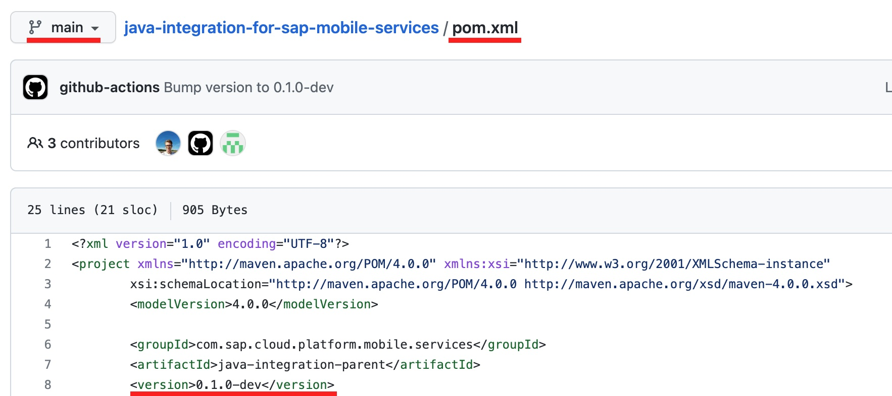
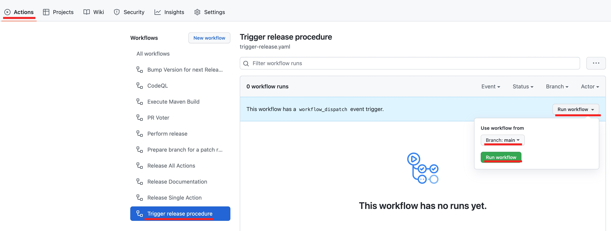
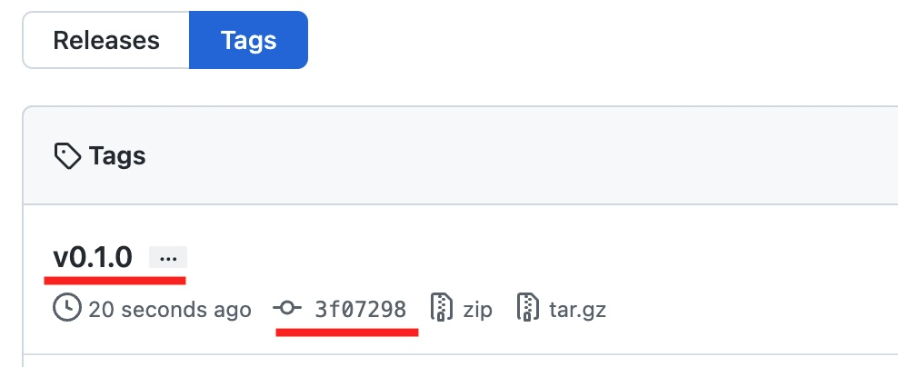
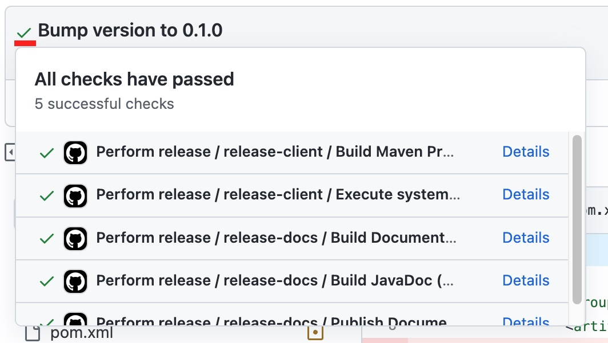
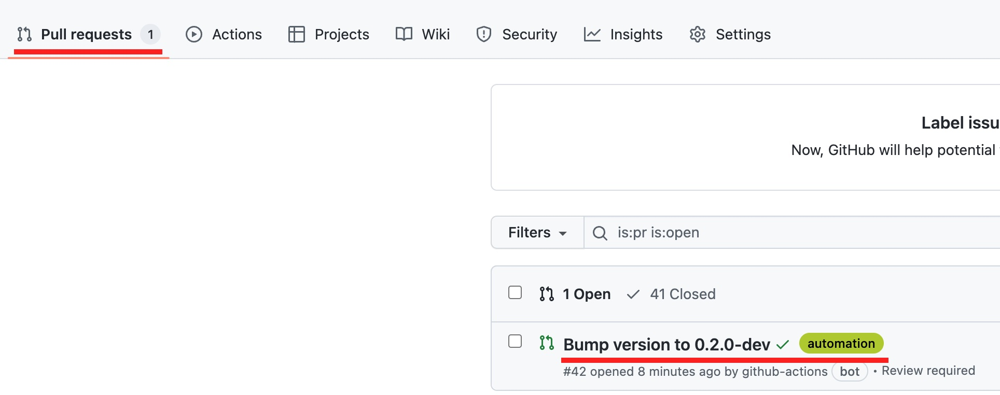
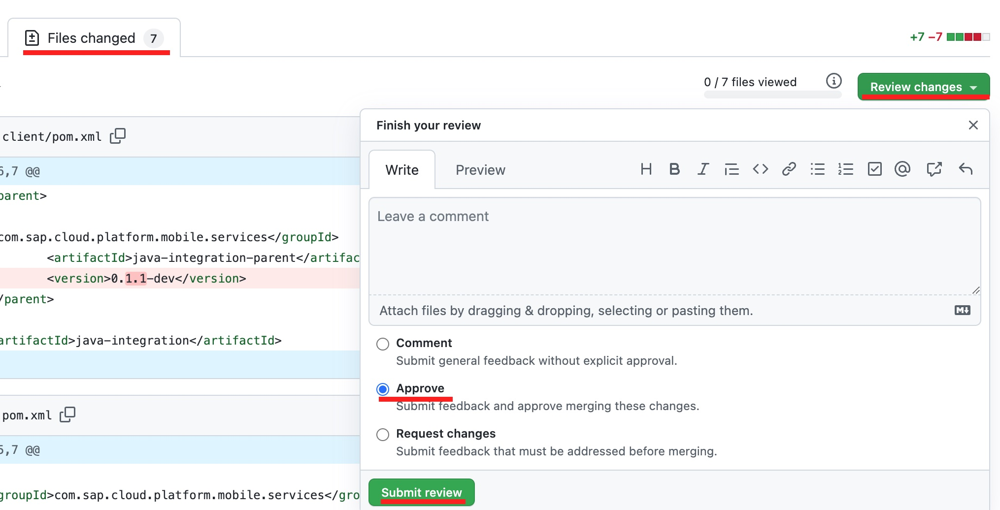
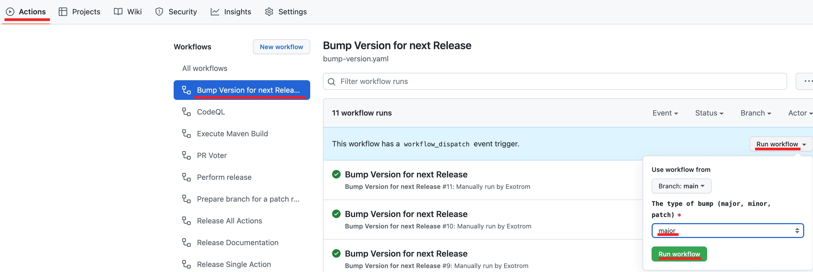

# How to Perform a Release

This document describes how a new release is prepared and published.  
By default, a new major or minor release is performed from the `main` branch.  
Only for patch releases of previous versions, a temporary release branch is used for performing the patch and release process.

## Trigger a Release

1. In order to perform a new release, first navigate to the branch you want to release (`main` for regular major/minor release - `rel/*` for a patch release):

    

    Open the `pom.xml` and verify that the version is correct. The one in the pom is the version of the upcoming release with the `-dev` suffix. In this example, the `0.1.0-dev` version results in the `0.1.0` release.  
    In case the version isn't correct, you can [manually bump the version](#manually-bump-the-version-on-main-branch). Also ensure all the commits are in place.

2. Trigger the release workflow:

    

    - Navigate to the `Actions` tab.
    - Search for the `Trigger release procedure` workflow
    - Click the `Run workflow` button in the top-right corner
    - Select the correct branch (probably `main`)
    - Click the `Run workflow` button
    - You might need to refresh the page in order to see the triggered job - wait for it to complete.

3. Inspect the created tag:

    

    - Navigate to the project overview
    - Select the `Tags` link in the top-right corner

    

    - Search for the correct tag and click on the commit

4. Wait for the release procedure to be completed. You can click on the progress indicator to open the list of jobs:

    

5. *Only for releases from the `main` branch:* Bump the version on the `main` branch for the next release:

    

    - Navigate to the `Pull requests` tab
    - A pull-request has been created automatically to bump the version in the `main` branch, open it.

    

    - Navigate to the `Files changed` tab of the pull-request
    - Inspect the updated files.
    - If everything is okay, click the `Review changes` button, select `Approve`, and submit the review.  
        **Note, the pull-request is merged automatically once all checks are completed.**
    - The `main` branch is now open for the next release.

## Create a Patch Release

1. In order to perform a patch release, trigger the `rel` branch creation:

    

    - Navigate to the `Actions` tab.
    - Search for the `Prepare branch for a patch release` workflow
    - Click the `Run workflow` button in the top-right corner
    - Select the correct release tag (e.g. if you want to create `v0.1.1` then select `v0.1.0`).
    - Click the `Run workflow` button
    - You might need to refresh the page in order to see the triggered job - wait for it to complete.
    - The job creates a new `rel` branch where you can maintain your patch (e.g. `rel/0.1.x`).

2. Maintain your patches in the corresponding `rel` branch. You can create pull-requests or directly push into the branch.
3. Once you're ready, run the release procedure as describes [here](#trigger-a-release).
4. Afterwards, you can delete the temporary `rel` branch.

## Manually Bump the Version on Main Branch

1. In case you want to manually bump the version in the `main` branch (e.g. for a major release) trigger the version bump:

    

    - Navigate to the `Actions` tab.
    - Search for the `Bump Version for next Release` workflow
    - Click the `Run workflow` button in the top-right corner
    - Select the correct bump type (major, minor, patch)
      - major: `1.2.3` -> `2.0.0`
      - minor: `1.2.3` -> `1.3.0`
      - patch: `1.2.3` -> `1.2.4`
    - Click the `Run workflow` button
    - You might need to refresh the page in order to see the triggered job - wait for it to complete.

2. Review and approve the created pull-request as described in step 5 of the [release flow](#how-to-perform-a-release).
